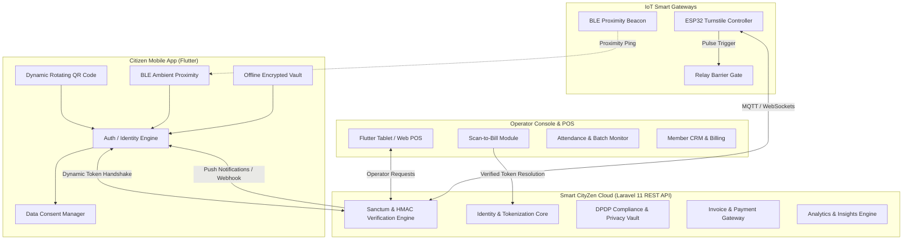
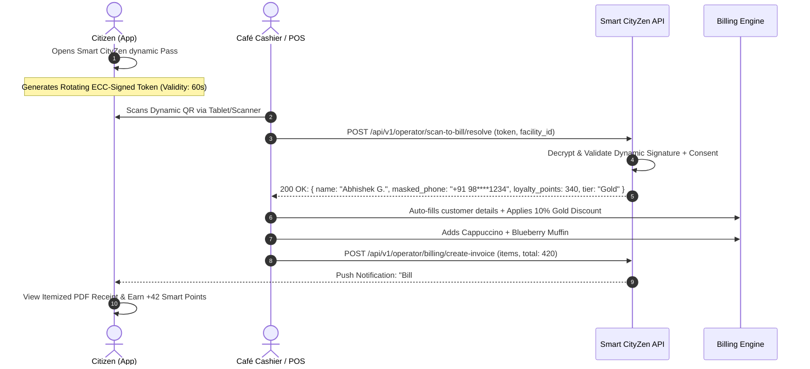
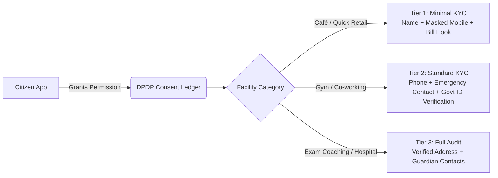

# 🌐 Smart CityZen: Master Product Blueprint, Architecture & Next Steps

> **Unified Digital Identity & Physical Commerce Layer for Cities**  
> *"One Person. One Reusable Digital Identity. Many Places. One Platform."*  
> **Document Version:** 2.0.0 • **Target Platforms:** Flutter 3.x (iOS/Android/Web) & Laravel 11 Backend  
> **Design Theme:** *Luminous Urbanity v2* (Cyber Cyan `#00E3FD`, Deep Indigo `#000314`, Electric Indigo `#4361EE`)

---

## 1. Executive Summary & The "Island Problem"

Physical spaces across cities remain disconnected data silos. When a citizen moves through their day—exercising at the gym, studying at a library, attending an exam prep coaching batch, grabbing coffee at a neighborhood café, and visiting a co-working space—every facility treats them as a total stranger.

```
       [ TRADITIONAL CITIZEN EXPERIENCE: THE FRAGMENTED ISLANDS ]
       
 ┌─────────────┐      ┌─────────────┐      ┌─────────────┐      ┌─────────────┐
 │   GYM       │      │   LIBRARY   │      │   COACHING  │      │    CAFÉ     │
 │ ─────────── │      │ ─────────── │      │ ─────────── │      │ ─────────── │
 │ • Paper Log │      │ • Plastic ID│      │ • Roll Call │      │ • Call out  │
 │ • Re-KYC    │      │ • Card Loss │      │ • Biometric │      │   Mobile #  │
 │ • Standalone│      │ • Isolated  │      │   Failure   │      │ • Paper Bill│
 │   POS App   │      │   Deposit   │      │ • Excel DB  │      │ • Spam SMS  │
 └──────┬──────┘      └──────┬──────┘      └──────┬──────┘      └──────┬──────┘
        │                    │                    │                    │
        └────────────────────┴──────────┬─────────┴────────────────────┘
                                        ▼
                   CITIZEN FATIGUE & DATA SPRAWL:
       15+ Logins • Repeated Privacy Leaks • 0 Portability
```

### The Smart CityZen Paradigm Shift
Smart CityZen establishes a **sovereign, interoperable identity and ambient interaction fabric** bridging citizens and businesses.

```
       [ THE SMART CITYZEN UNIFIED PHYSICAL OPERATING SYSTEM ]

                         ┌───────────────────────┐
                         │   SMART CITYZEN ID    │
                         │  (Citizen App Wallet) │
                         │   Dynamic Crypto QR   │
                         │   BLE Ambient Beacon  │
                         └──────────┬────────────┘
                                    │
    ┌───────────────────────────────┼───────────────────────────────┐
    ▼                               ▼                               ▼
┌──────────────┐             ┌──────────────┐             ┌──────────────┐
│  FITNESS &   │             │ EDUCATION &  │             │ QUICK RETAIL │
│   WELLNESS   │             │  LIBRARIES   │             │   & CAFÉS    │
│ ──────────── │             │ ──────────── │             │ ──────────── │
│ • 0.2s Gates │             │ • Smart Slot │             │ • Instant 1s │
│ • Streak CRM │             │ • Desk IoT   │             │   Scan-Bill  │
│ • Sub AutoPay│             │ • RFID Bridge│             │ • Loyalty FX │
└──────────────┘             └──────────────┘             └──────────────┘
```

---

## 2. High-Level System Architecture



---

## 3. The Killer Feature: Scan-to-Bill & Express Customer Onboarding

### The Real-World Friction at Cafés & Retail Counters
* **Current Pain:** Cashiers verbally ask, *"Sir, your mobile number for the bill?"* The customer shouts it out in a crowded café. Strangers overhear, numbers get mistyped, marketing spam begins, and the line backs up.
* **Smart CityZen Solution:** Customer shows their Smart CityZen dynamic QR code on their phone or smartwatch. The cashier scans it using the CityZen POS Scanner. In **300 milliseconds**, the billing screen auto-populates the customer's verified name, loyalty tier, and billing profile.



---

## 4. Feature Matrix Across Facility Verticals

| Vertical | Citizen Value Proposition | Business / Operator Value Proposition | IoT Hardware Integration |
| :--- | :--- | :--- | :--- |
| **Gyms & Fitness Clubs** | Contactless entry, no physical card, streak tracking, workout slot reservation. | Zero proxy check-ins, automated renewal reminders, live gym floor crowd meter. | ESP32 + Wiegand Turnstile Gate Relay, Biometric fallback. |
| **Study Libraries** | Hourly seat booking, silent presence verification, overdue alerts. | Automated shift/seat management, power slot relay switching, deposit escrow. | Smart Desk Relays (turn power ON upon verified check-in). |
| **Coaching Institutes** | Multi-batch schedules, automated parent notification upon student arrival. | Batch-wise roll call in 2 seconds, fee installment tracker, faculty console. | Long-range BLE Gate Node / High-speed QR scanner pedestal. |
| **Cafés & Quick Retail** | Express check-out, no shouting phone numbers, instant digital invoice vault. | 1-second customer onboarding, zero invalid phone numbers, automatic loyalty stamps. | Bluetooth Barcode Scanner / Flutter Web Tablet POS. |
| **Co-working Spaces** | 1-tap Wi-Fi voucher issuance, meeting room unlock, visitor pass link. | Dynamic desk monetization, visitor KYC compliance, multi-tenant billing. | Electronic Door Strike Locks / NFC Readers. |
| **Events & Exhibitions** | Sovereign ticket pass, multi-stall badge scan, digital brochure collector. | Fast queue throughput, real-time footfall heatmap, sponsor lead generation. | Mobile POS handhelds, NFC wristbands. |

---

## 5. Strategic Roadmap: 4 Phases to Full Scale

```
[ PHASE 1: IMMEDIATE ]   ──►  [ PHASE 2: SHORT TERM ]  ──►  [ PHASE 3: MID TERM ]   ──►  [ PHASE 4: LONG TERM ]
Core Identity & Scan-to-Bill  Café Commerce & Loyalty        IoT Edge Access Node        City-Wide Network Fabric
• Dynamic Rotating Pass       • POS Bill Generator           • ESP32 MQTT Firmware       • Multi-facility Passports
• 1-Tap QR Verification       • Digital Receipt Push         • BLE Presence Handshake    • Open Civic API SDK
• Privacy Consent Engine      • Loyalty Stamps System        • Hardware Turnstile Sync   • White-label Franchises
```

### Phase Breakdown & Deliverables

#### Phase 1: Dynamic Identity & Instant Scan-to-Bill (Immediate — Next 2-3 Weeks)
* **Goal:** Turn the Citizen App into a universal passport and provide an instant scanner for any business.
* **Key Tasks:**
  1. Build `CitizenDynamicPassCard` with time-rotating TOTP/HMAC QR code (regenerates every 45s to prevent screenshot sharing).
  2. Implement `ScanToBillOperatorModal` in the operator console.
  3. Deploy Laravel DPDP-compliant consent API endpoints.

#### Phase 2: Café & Retail Express Commerce (Month 2)
* **Goal:** Enable quick-service billing and automated loyalty point accumulation.
* **Key Tasks:**
  1. Add itemized fast-billing interface inside `smartcityzenv2` for small shops and café counters.
  2. Implement WhatsApp / In-App PDF bill dispatch.
  3. Introduce cross-merchant loyalty wallet ("CityZen Stars").

#### Phase 3: Connected IoT Edge Verification (Months 3 - 4)
* **Goal:** Eliminate manual human check-ins for high-throughput venues (Gyms, Turnstiles, Library Gates).
* **Key Tasks:**
  1. Finalize ESP32 microcontroller firmware with Wi-Fi / MQTT + relay control.
  2. In-app BLE beacon presence broadcasting (`flutter_ble_peripheral` + `flutter_blue_plus`).
  3. Edge offline-fallback cache for turnstiles when internet is disconnected.

#### Phase 4: Network Effects & B2B SaaS Scale (Months 5+)
* **Goal:** Expand merchant acquisition through tiered subscriptions and cross-discovery.
* **Key Tasks:**
  1. Multi-tier B2B billing (Stripe/Razorpay Subscriptions).
  2. "Nearby Verified Facilities" location-based discovery feed for citizens.
  3. Municipal and corporate campus integrations.

---

## 6. Recommended Flutter Components to Build Next

To implement this vision, the following modular UI/UX components should be added to `smartcityzenv2`:

```
lib/features/
├── identity_pass/
│   ├── presentation/
│   │   ├── widgets/
│   │   │   ├── citizen_dynamic_pass_card.dart     # Rotating TOTP QR + Glassmorphic ID
│   │   │   ├── data_consent_sheet.dart            # Granular sharing permissions
│   │   │   └── biometric_vault_badge.dart         # LocalAuth protection wrapper
│   │   └── controllers/
│   │       └── dynamic_pass_controller.dart       # Riverpod 3.x rotating token state
├── scan_to_bill/
│   ├── presentation/
│   │   ├── screens/
│   │   │   ├── operator_quick_bill_screen.dart    # Cashier instant billing UI
│   │   │   └── customer_scan_result_sheet.dart    # Customer profile popup
│   │   └── widgets/
│   │       ├── quick_cart_item_tile.dart          # Rapid add-item buttons for café
│   │       └── invoice_success_dialog.dart        # Digital receipt summary
└── loyalty/
    └── presentation/
        └── widgets/
            └── universal_stamp_card.dart          # Visual punch card for visits
```

---

## 7. Production-Ready Flutter Component Implementation

### Component 1: `CitizenDynamicPassCard` (Rotating Dynamic QR with Security Ring)

This component displays a verified citizen card featuring an auto-refreshing cryptographic token, countdown timer, biometric protection, and holographic visual flair.

```dart
// lib/features/identity_pass/presentation/widgets/citizen_dynamic_pass_card.dart
import 'dart:async';
import 'dart:convert';
import 'package:crypto/crypto.dart';
import 'package:flutter/material.dart';
import 'package:qr_flutter/qr_flutter.dart';

class CitizenDynamicPassCard extends StatefulWidget {
  final String citizenId;
  final String citizenName;
  final String avatarUrl;
  final String secretKey;
  final VoidCallback? onConsentSettingsTap;

  const CitizenDynamicPassCard({
    super.key,
    required this.citizenId,
    required this.citizenName,
    required this.avatarUrl,
    required this.secretKey,
    this.onConsentSettingsTap,
  });

  @override
  State<CitizenDynamicPassCard> createState() => _CitizenDynamicPassCardState();
}

class _CitizenDynamicPassCardState extends State<CitizenDynamicPassCard> {
  late Timer _timer;
  int _secondsRemaining = 45;
  String _currentQrPayload = '';

  @override
  void initState() {
    super.initState();
    _regenerateToken();
    _timer = Timer.periodic(const Duration(seconds: 1), (timer) {
      if (!mounted) return;
      setState(() {
        if (_secondsRemaining > 1) {
          _secondsRemaining--;
        } else {
          _regenerateToken();
        }
      });
    });
  }

  void _regenerateToken() {
    final int timestampEpoch = DateTime.now().millisecondsSinceEpoch ~/ 1000;
    // Window rounds to 45 seconds to prevent network lag race conditions
    final int timeWindow = timestampEpoch ~/ 45;
    
    // Cryptographic HMAC token generation
    final hmac = Hmac(sha256, utf8.encode(widget.secretKey));
    final digest = hmac.convert(utf8.encode('${widget.citizenId}:$timeWindow'));
    final String signature = digest.toString().substring(0, 16);

    final payloadMap = {
      "v": "2",
      "cid": widget.citizenId,
      "w": timeWindow,
      "sig": signature,
      "type": "cityzen_pass"
    };

    setState(() {
      _secondsRemaining = 45;
      _currentQrPayload = jsonEncode(payloadMap);
    });
  }

  @override
  void dispose() {
    _timer.cancel();
    super.dispose();
  }

  @override
  Widget build(BuildContext context) {
    final progress = _secondsRemaining / 45.0;

    return Container(
      width: double.infinity,
      constraints: const BoxConstraints(maxWidth: 380),
      decoration: BoxDecoration(
        borderRadius: BorderRadius.circular(28),
        gradient: const LinearGradient(
          begin: Alignment.topLeft,
          end: Alignment.bottomRight,
          colors: [
            Color(0xFF0F172A),
            Color(0xFF000314),
          ],
        ),
        border: Border.all(
          color: const Color(0xFF00E3FD).withValues(alpha: 0.35),
          width: 1.5,
        ),
        boxShadow: [
          BoxShadow(
            color: const Color(0xFF00E3FD).withValues(alpha: 0.15),
            blurRadius: 28,
            spreadRadius: -4,
          ),
        ],
      ),
      child: Stack(
        children: [
          // Cyber Ambient Glow Elements
          Positioned(
            right: -20,
            top: -20,
            child: Container(
              width: 110,
              height: 110,
              decoration: BoxDecoration(
                shape: BoxShape.circle,
                color: const Color(0xFF4361EE).withValues(alpha: 0.2),
              ),
            ),
          ),
          Padding(
            padding: const EdgeInsets.all(24.0),
            child: Column(
              mainAxisSize: MainAxisSize.min,
              children: [
                // Top Header: Brand & Security Chip
                Row(
                  mainAxisAlignment: MainAxisAlignment.spaceBetween,
                  children: [
                    Row(
                      children: [
                        Container(
                          width: 38,
                          height: 38,
                          decoration: BoxDecoration(
                            color: const Color(0xFF00E3FD).withValues(alpha: 0.15),
                            shape: BoxShape.circle,
                            border: Border.all(color: const Color(0xFF00E3FD)),
                          ),
                          child: const Icon(Icons.hub_rounded, color: Color(0xFF00E3FD), size: 20),
                        ),
                        const SizedBox(width: 12),
                        Column(
                          crossAxisAlignment: CrossAxisAlignment.start,
                          children: [
                            const Text(
                              'SMART CITYZEN',
                              style: TextStyle(
                                color: Colors.white,
                                fontWeight: FontWeight.w800,
                                fontSize: 13,
                                letterSpacing: 1.5,
                              ),
                            ),
                            Text(
                              'Universal Pass • Verified',
                              style: TextStyle(
                                color: const Color(0xFF00E3FD).withValues(alpha: 0.8),
                                fontSize: 11,
                                fontWeight: FontWeight.w500,
                              ),
                            ),
                          ],
                        ),
                      ],
                    ),
                    IconButton(
                      icon: const Icon(Icons.shield_outlined, color: Color(0xFF00E3FD)),
                      onPressed: widget.onConsentSettingsTap,
                      tooltip: 'Privacy & Sharing Rules',
                    ),
                  ],
                ),
                const SizedBox(height: 24),

                // Center QR Code with Holographic Border
                Center(
                  child: Container(
                    padding: const EdgeInsets.all(14),
                    decoration: BoxDecoration(
                      color: Colors.white,
                      borderRadius: BorderRadius.circular(20),
                      boxShadow: [
                        BoxShadow(
                          color: Colors.black.withValues(alpha: 0.4),
                          blurRadius: 16,
                          offset: const Offset(0, 6),
                        ),
                      ],
                    ),
                    child: SizedBox(
                      width: 180,
                      height: 180,
                      child: QrImageView(
                        data: _currentQrPayload,
                        version: QrVersions.auto,
                        size: 180.0,
                        eyeStyle: const QrEyeStyle(
                          eyeShape: QrEyeShape.square,
                          color: Color(0xFF000314),
                        ),
                        dataModuleStyle: const QrDataModuleStyle(
                          dataModuleShape: QrDataModuleShape.circle,
                          color: Color(0xFF000314),
                        ),
                      ),
                    ),
                  ),
                ),
                const SizedBox(height: 20),

                // Progress Indicator & Security Timer
                Row(
                  mainAxisAlignment: MainAxisAlignment.center,
                  children: [
                    SizedBox(
                      width: 16,
                      height: 16,
                      child: CircularProgressIndicator(
                        value: progress,
                        strokeWidth: 2.5,
                        backgroundColor: Colors.white12,
                        valueColor: const AlwaysStoppedAnimation<Color>(Color(0xFF00E3FD)),
                      ),
                    ),
                    const SizedBox(width: 10),
                    Text(
                      'Refreshing in ${_secondsRemaining}s',
                      style: TextStyle(
                        color: Colors.white.withValues(alpha: 0.6),
                        fontSize: 12,
                        fontFeatures: const [FontFeature.tabularFigures()],
                      ),
                    ),
                  ],
                ),
                const SizedBox(height: 20),

                // Citizen Identity Badge
                Container(
                  padding: const EdgeInsets.symmetric(horizontal: 16, vertical: 12),
                  decoration: BoxDecoration(
                    color: Colors.white.withValues(alpha: 0.05),
                    borderRadius: BorderRadius.circular(16),
                    border: Border.all(color: Colors.white10),
                  ),
                  child: Row(
                    children: [
                      CircleAvatar(
                        radius: 20,
                        backgroundColor: const Color(0xFF4361EE),
                        backgroundImage: widget.avatarUrl.isNotEmpty
                            ? NetworkImage(widget.avatarUrl)
                            : null,
                        child: widget.avatarUrl.isEmpty
                            ? Text(widget.citizenName[0],
                                style: const TextStyle(color: Colors.white, fontWeight: FontWeight.bold))
                            : null,
                      ),
                      const SizedBox(width: 14),
                      Expanded(
                        child: Column(
                          crossAxisAlignment: CrossAxisAlignment.start,
                          children: [
                            Text(
                              widget.citizenName,
                              style: const TextStyle(
                                color: Colors.white,
                                fontWeight: FontWeight.w700,
                                fontSize: 14,
                              ),
                              overflow: TextOverflow.ellipsis,
                            ),
                            Text(
                              'ID: ${widget.citizenId}',
                              style: TextStyle(
                                color: Colors.white.withValues(alpha: 0.5),
                                fontSize: 11,
                                letterSpacing: 0.8,
                              ),
                            ),
                          ],
                        ),
                      ),
                      Container(
                        padding: const EdgeInsets.symmetric(horizontal: 8, vertical: 4),
                        decoration: BoxDecoration(
                          color: const Color(0xFF10B981).withValues(alpha: 0.2),
                          borderRadius: BorderRadius.circular(8),
                          border: Border.all(color: const Color(0xFF10B981).withValues(alpha: 0.5)),
                        ),
                        child: const Text(
                          'ACTIVE',
                          style: TextStyle(
                            color: Color(0xFF10B981),
                            fontSize: 10,
                            fontWeight: FontWeight.bold,
                          ),
                        ),
                      ),
                    ],
                  ),
                ),
              ],
            ),
          ),
        ],
      ),
    );
  }
}
```

---

### Component 2: `ScanToBillOperatorModal` (Fast Cashier Scanner & Express Cart)

This component is used on the **Operator/Café side** to scan the citizen's dynamic QR code, resolve customer identity, and produce an instant itemized invoice.

```dart
// lib/features/scan_to_bill/presentation/widgets/scan_to_bill_operator_modal.dart
import 'package:flutter/material.dart';
import 'package:mobile_scanner/mobile_scanner.dart';

class ScanToBillOperatorModal extends StatefulWidget {
  final String facilityId;
  final Function(Map<String, dynamic> customerData) onCustomerIdentified;

  const ScanToBillOperatorModal({
    super.key,
    required this.facilityId,
    required this.onCustomerIdentified,
  });

  @override
  State<ScanToBillOperatorModal> createState() => _ScanToBillOperatorModalState();
}

class _ScanToBillOperatorModalState extends State<ScanToBillOperatorModal> {
  final MobileScannerController _scannerController = MobileScannerController(
    detectionSpeed: DetectionSpeed.noDuplicates,
  );
  bool _isProcessing = false;

  void _handleBarcode(BarcodeCapture capture) async {
    if (_isProcessing) return;
    final List<Barcode> barcodes = capture.barcodes;
    if (barcodes.isEmpty) return;

    final String? rawCode = barcodes.first.rawValue;
    if (rawCode == null || !rawCode.contains('cityzen_pass')) return;

    setState(() => _isProcessing = true);

    try {
      // In production: Call Riverpod provider to resolve token against API
      // POST /api/v1/operator/scan-to-bill/resolve
      await Future.delayed(const Duration(milliseconds: 300)); // Simulating network handshake

      final mockResolvedCustomer = {
        "citizen_id": "CZ-99824",
        "name": "Abhishek Gupta",
        "masked_phone": "+91 98****3210",
        "membership_status": "Gold Member",
        "loyalty_balance": 240,
        "discount_percent": 10.0,
      };

      if (mounted) {
        Navigator.pop(context);
        widget.onCustomerIdentified(mockResolvedCustomer);
      }
    } catch (e) {
      if (mounted) {
        ScaffoldMessenger.of(context).showSnackBar(
          SnackBar(content: Text('Verification failed: $e'), backgroundColor: Colors.red),
        );
        setState(() => _isProcessing = false);
      }
    }
  }

  @override
  void dispose() {
    _scannerController.dispose();
    super.dispose();
  }

  @override
  Widget build(BuildContext context) {
    return Dialog(
      backgroundColor: const Color(0xFF000814),
      shape: RoundedRectangleBorder(
        borderRadius: BorderRadius.circular(24),
        side: const BorderSide(color: Color(0xFF00E3FD), width: 1.5),
      ),
      child: Container(
        width: 440,
        padding: const EdgeInsets.all(24),
        child: Column(
          mainAxisSize: MainAxisSize.min,
          children: [
            Row(
              mainAxisAlignment: MainAxisAlignment.spaceBetween,
              children: [
                const Row(
                  children: [
                    Icon(Icons.qr_code_scanner, color: Color(0xFF00E3FD)),
                    SizedBox(width: 10),
                    Text(
                      'Express Scan-to-Bill',
                      style: TextStyle(color: Colors.white, fontSize: 18, fontWeight: FontWeight.bold),
                    ),
                  ],
                ),
                IconButton(
                  icon: const Icon(Icons.close, color: Colors.white60),
                  onPressed: () => Navigator.pop(context),
                ),
              ],
            ),
            const SizedBox(height: 8),
            const Text(
              'Point camera at the customer’s Smart CityZen dynamic QR pass',
              style: TextStyle(color: Colors.white70, fontSize: 12),
              textAlign: TextAlign.center,
            ),
            const SizedBox(height: 20),
            ClipRRect(
              borderRadius: BorderRadius.circular(16),
              child: SizedBox(
                height: 260,
                width: 260,
                child: Stack(
                  alignment: Alignment.center,
                  children: [
                    MobileScanner(
                      controller: _scannerController,
                      onDetect: _handleBarcode,
                    ),
                    Container(
                      decoration: BoxDecoration(
                        border: Border.all(color: const Color(0xFF00E3FD), width: 2),
                        borderRadius: BorderRadius.circular(16),
                      ),
                    ),
                    if (_isProcessing)
                      Container(
                        color: Colors.black87,
                        child: const Center(
                          child: Column(
                            mainAxisSize: MainAxisSize.min,
                            children: [
                              CircularProgressIndicator(color: Color(0xFF00E3FD)),
                              SizedBox(height: 12),
                              Text('Resolving Profile...', style: TextStyle(color: Colors.white)),
                            ],
                          ),
                        ),
                      ),
                  ],
                ),
              ),
            ),
            const SizedBox(height: 20),
            OutlinedButton.icon(
              onPressed: () {
                // Fallback manual mobile search
              },
              icon: const Icon(Icons.dialpad, size: 16),
              label: const Text('Manual Lookup Fallback'),
              style: OutlinedButton.styleFrom(
                foregroundColor: Colors.white70,
                side: const BorderSide(color: Colors.white24),
              ),
            ),
          ],
        ),
      ),
    );
  }
}
```

---

## 8. Backend API Specifications (Laravel 11)

### 8.1 Endpoint: Dynamic Token Resolution (`POST /api/v1/operator/scan-to-bill/resolve`)

#### Request Body
```json
{
  "facility_id": 14,
  "qr_payload": "{\"v\":\"2\",\"cid\":\"CZ-99824\",\"w\":3948210,\"sig\":\"a8f9c1b3d2e4f5a6\",\"type\":\"cityzen_pass\"}",
  "operator_device_id": "POS-TERMINAL-01"
}
```

#### Response Body (200 OK)
```json
{
  "success": true,
  "data": {
    "citizen_id": "CZ-99824",
    "display_name": "Abhishek Gupta",
    "masked_phone": "+91 98****3210",
    "email_masked": "abh*****@gmail.com",
    "is_member": true,
    "membership": {
      "plan_name": "Café Regular Tier",
      "discount_percentage": 10.0,
      "valid_until": "2026-12-31"
    },
    "loyalty": {
      "points_balance": 450,
      "redeemable_value_in_inr": 45.0
    },
    "preferences": {
      "dietary": "Vegetarian",
      "receive_whatsapp_bill": true
    },
    "session_auth_token": "tmp_bill_sess_78f1a0e9c"
  }
}
```

### 8.2 Endpoint: Instant Invoice Creation (`POST /api/v1/operator/billing/create-invoice`)

#### Request Body
```json
{
  "facility_id": 14,
  "citizen_id": "CZ-99824",
  "session_auth_token": "tmp_bill_sess_78f1a0e9c",
  "items": [
    {"name": "Pour-Over Coffee (Ethiopia)", "qty": 1, "unit_price": 280.0},
    {"name": "Almond Croissant", "qty": 1, "unit_price": 180.0}
  ],
  "subtotal": 460.0,
  "discount_applied": 46.0,
  "tax": 20.7,
  "total_amount": 434.7,
  "payment_method": "UPI",
  "dispatch_channel": ["IN_APP_PUSH", "WHATSAPP"]
}
```

#### Response Body (201 Created)
```json
{
  "success": true,
  "invoice_number": "INV-2026-BT-0941",
  "pdf_download_url": "https://api.smartcityzen.in/storage/invoices/INV-2026-BT-0941.pdf",
  "loyalty_points_awarded": 43,
  "new_loyalty_balance": 493,
  "message": "Bill generated and dispatched to citizen pass."
}
```

---

## 9. Data Privacy & Compliance (DPDP Act 2023 & GDPR)

Because Smart CityZen acts as a shared digital identity platform, strict data minimization and user sovereignty must be preserved:



### Privacy Guarantee Matrix

| Data Field | Storage Format | Visible to Café Cashier | Visible to Gym Manager | Retention Policy |
| :--- | :--- | :--- | :--- | :--- |
| **Full Phone Number** | AES-256 Encrypted in DB Vault | ❌ Never (Only `+91 98****1234`) | ✅ Yes (If explicitly permitted) | Revocable by Citizen anytime |
| **Govt Photo ID (Aadhaar/DL)** | SHA-256 Hash + Digilocker Token | ❌ Hidden | ✅ Masked document preview | Purged 90 days after membership end |
| **Itemized Invoices** | Immutable Event Log | ✅ Store receipts only | ✅ Subscription invoices only | 7 years (Tax compliance) |
| **Check-In Timestamps** | Cryptographic audit trail | ❌ Not accessible | ✅ Live presence log | 180-day rolling purge |

---

## 10. B2B SaaS Commercial Model & Monetization

```
                             [ REVENUE ARCHITECTURE ]

          ┌─────────────────────────────────────────────────────────┐
          │               RECURRING B2B SOFTWARE SAAS               │
          │ • Starter Plan: ₹999/mo (Cafés, Boutiques, Studios)    │
          │ • Pro Plan: ₹2,499/mo (Gyms, Coaching, Libraries)      │
          │ • Campus / Enterprise: ₹7,999/mo (Colleges, Malls)      │
          └───────────────────────────┬─────────────────────────────┘
                                      │
        ┌─────────────────────────────┴─────────────────────────────┐
        ▼                                                           ▼
┌──────────────────────────────┐             ┌──────────────────────────────┐
│       IOT HARDWARE SALES     │             │     CITIZEN MICRO-PASSES     │
│ • Turnstile Node: ₹4,999     │             │ • "All-Access City Pass"     │
│ • BLE Proximity Beacon: ₹999 │             │   Day pass split with        │
│ • Smart Power Relay: ₹1,499  │             │   participating spaces       │
└──────────────────────────────┘             └──────────────────────────────┘
```

---

## 11. Concrete Next Steps Checklist (What to Do Tomorrow)

### Day 1–3: Dynamic Pass & Security Hardening
- [ ] Add `CitizenDynamicPassCard` into `lib/features/membership/` or `lib/features/identity_pass/`.
- [ ] Implement TOTP rotating token generator with 45-second window.
- [ ] Test screen capture prevention using `flutter_windowmanager` (`FLAG_SECURE`) on Android to prevent pass screenshot leaks.

### Day 4–7: Scan-to-Bill Operator Prototype
- [ ] Create `ScanToBillOperatorModal` using `mobile_scanner: ^7.0.1`.
- [ ] Implement instant customer profile card upon scan completion.
- [ ] Wire up mock items (Coffee, Croissant, Day Pass, Smoothie) and generate instant mock receipt.

### Day 8–12: Backend API & Database Migrations
- [ ] Create Laravel migration for `invoices`, `invoice_items`, and `scan_to_bill_sessions`.
- [ ] Implement HMAC verification middleware for incoming QR tokens.
- [ ] Implement WhatsApp bill dispatch job via Twilio / Meta Cloud API.

### Day 13–16: Hardware Turnstile & Ambient Bluetooth
- [ ] Flash ESP32 prototype board with MQTT turnstile gate relay.
- [ ] Test BLE beacon advertisement in background for proximity presence.
- [ ] Measure end-to-end latency from scan to barrier gate opening (Target: `< 400ms`).
