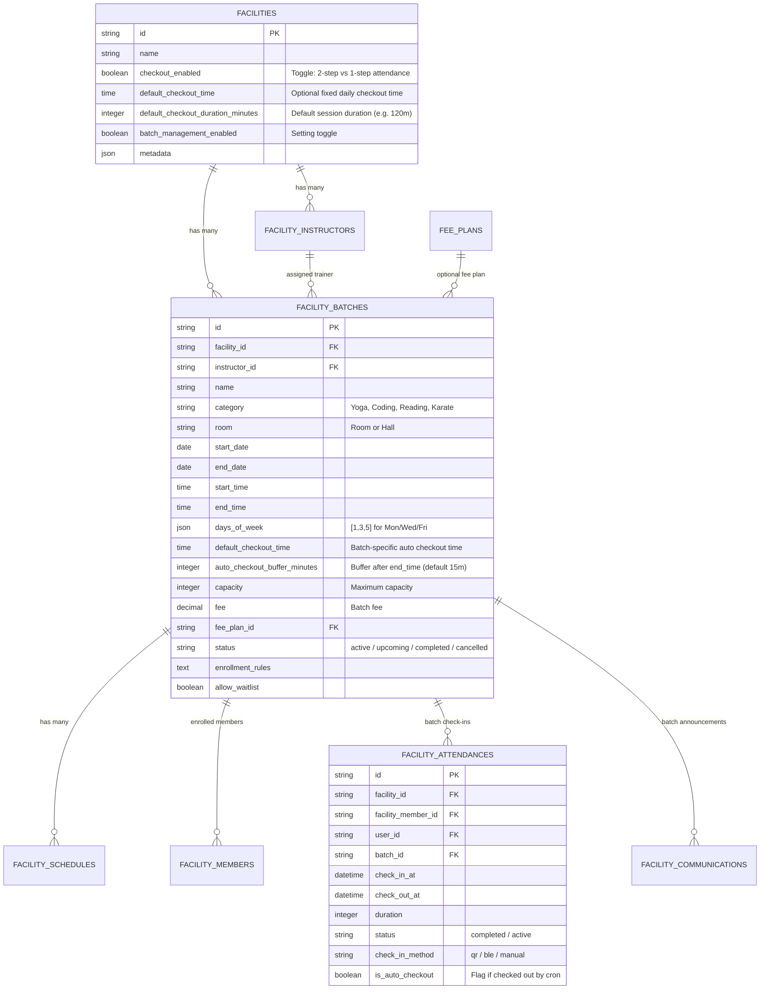

# Implementation Plan: Batch Management, Checkout Preferences & Automated Attendance Lifecycle

A unified, production-grade implementation combining:
1. **Batch Class Management Module**: Scheduled batches, recurring days, trainer assignments, capacity limits, enrollments, batch attendance & announcements.
2. **Dynamic Member Enrollment**: If batch management is enabled, after selecting/scanning a member in **Add Member**, provide a toggle to enroll via **"Batch / Class"** or **"Standard Fee Plan"**. Selecting a batch from the dropdown automatically populates the fee amount from the batch fee and assigns `batch_id`.
3. **Checkout Settings & Instant Single-Scan Mode**: Facility toggle for `checkout_enabled`. When disabled, check-in records check-out simultaneously with **zero check-out notifications**. When enabled, supports configurable **Default Checkout Time / Duration**.
4. **Batch-Level Default Checkout**: If batches are enabled, each batch specifies its own default checkout time / auto-checkout buffer (e.g. at batch end time).
5. **Hourly Background Auto-Checkout Cron Job**: Runs every hour to check active attendances and automatically check out users based on batch schedule or facility default checkout policy.

---

## User Review Required

> [!IMPORTANT]
> ### Key Operational Behaviors
> 1. **Dynamic Add Member Flow with Batches**:
>    - When **Batch Management** is active for a facility, the **Add Member Modal** dynamically unlocks a toggle:
>      - **Enroll in Batch / Class**: Shows a Batch dropdown (with real-time capacity meters). Selecting a batch auto-populates the fee amount directly from `batch.fee` and sets `batch_id`.
>      - **Standard Fee Plan**: Shows standard facility fee plans (Monthly, Quarterly, Annual).
>    - If batch management is disabled, the standard fee plan flow continues without extra steps.
> 2. **When Checkout is Disabled (`checkout_enabled = false`)**:
>    - Member check-in (QR scan, BLE, or desk entry) immediately sets `check_in_at = now()`, `check_out_at = now()`, `duration = 0`, and `status = 'completed'`.
>    - **Notifications**: Citizen receives **Check-In Notification** only. **Check-Out Notification is suppressed entirely**.
>    - **No Lingering Sessions**: Active session timer banner in mobile app is bypassed.
> 3. **When Checkout is Enabled (`checkout_enabled = true`)**:
>    - Facility can configure a **Default Checkout Policy** (`default_checkout_time` or `default_checkout_duration_minutes`, default 120 mins).
>    - If **Batch Management** is enabled, each batch defines its own scheduled `start_time`, `end_time`, and **Batch Auto-Checkout Time** (e.g., at class end time + 15m buffer).
> 4. **Hourly Background Cron (`attendance:auto-checkout`)**:
>    - Runs every hour (`0 * * * *`).
>    - Evaluates all unclosed attendances (`check_out_at IS NULL`):
>      - **Batch-assigned sessions**: Automatically checked out once the batch end time (+ buffer) has passed for today.
>      - **General facility sessions**: Automatically checked out once `check_in_at + default_checkout_duration_minutes` or `facility.closing_time` has elapsed.
>      - Sends standard auto-checkout notification and logs audit trail.

---

## 1. Architectural & Database Schema



---

## 2. Proposed Changes

### Backend: Laravel API (`smart-citizen-api-v1`)

#### Database Migrations
- **[NEW]** `database/migrations/2026_09_01_000001_add_checkout_and_batch_settings_to_facilities.php`
  - Add to `facilities` table:
    - `checkout_enabled` (boolean, default `true`)
    - `default_checkout_time` (time, nullable)
    - `default_checkout_duration_minutes` (unsignedSmallInteger, default `120`)
    - `batch_management_enabled` (boolean, default `false`)
  - Enhance `facility_batches` table:
    - `category` (string 100, nullable)
    - `room` (string 100, nullable)
    - `start_time` (time, nullable)
    - `end_time` (time, nullable)
    - `days_of_week` (json, nullable)
    - `default_checkout_time` (time, nullable)
    - `auto_checkout_buffer_minutes` (unsignedSmallInteger, default `15`)
    - `fee` (decimal 10,2, nullable)
    - `fee_plan_id` (char 10, nullable, FK to `fee_plans`)
    - `enrollment_rules` (text, nullable)
    - `allow_waitlist` (boolean, default `false`)
  - Enhance `facility_attendances` table:
    - `is_auto_checkout` (boolean, default `false`)
  - Enhance `facility_communications` table:
    - `batch_id` (char 10, nullable, FK to `facility_batches`)

#### Models & Resources
- **[MODIFY]** [Facility.php](file:///Users/abhishekgupta/Documents/LARAVELS/smart-citizen-api-v1/app/Models/Facility.php)
  - Add `checkout_enabled`, `default_checkout_time`, `default_checkout_duration_minutes`, `batch_management_enabled` to `$fillable` and `$casts`.
  - Add helper methods: `isCheckoutEnabled(): bool`, `hasBatchManagementEnabled(): bool`.
- **[MODIFY]** [FacilityBatch.php](file:///Users/abhishekgupta/Documents/LARAVELS/smart-citizen-api-v1/app/Models/FacilityBatch.php)
  - Add new fields (`category`, `room`, `start_time`, `end_time`, `days_of_week`, `default_checkout_time`, `auto_checkout_buffer_minutes`, `fee`, `fee_plan_id`, `enrollment_rules`, `allow_waitlist`) to `$fillable` and `$casts`.
  - Add relations: `feePlan()`, `attendances()`, `communications()`.
  - Add helpers: `enrolled_count`, `available_spots`, `is_full`, `effective_checkout_time`.
- **[MODIFY]** [FacilityAttendance.php](file:///Users/abhishekgupta/Documents/LARAVELS/smart-citizen-api-v1/app/Models/FacilityAttendance.php)
  - Add `is_auto_checkout` to `$fillable` and `$casts` (`boolean`).
- **[MODIFY]** [FacilityResource.php](file:///Users/abhishekgupta/Documents/LARAVELS/smart-citizen-api-v1/app/Http/Resources/V1/FacilityResource.php)
  - Expose `checkout_enabled`, `default_checkout_time`, `default_checkout_duration_minutes`, `batch_management_enabled`.
- **[MODIFY]** [FacilityBatchResource.php](file:///Users/abhishekgupta/Documents/LARAVELS/smart-citizen-api-v1/app/Http/Resources/V1/FacilityBatchResource.php)
  - Expose all batch schedule, capacity, fee, and auto-checkout timing properties.

#### Member Enrollment with Batch Support
- **[MODIFY]** [ClientFacilityController.php](file:///Users/abhishekgupta/Documents/LARAVELS/smart-citizen-api-v1/app/Http/Controllers/Api/V1/ClientFacilityController.php) & [FacilityMemberService.php](file:///Users/abhishekgupta/Documents/LARAVELS/smart-citizen-api-v1/app/Services/FacilityMemberService.php)
  - In `storeMember()` / `enroll()`:
    - Accept optional `batch_id` and `amount`.
    - If `batch_id` is supplied:
      - Validate batch belongs to facility and has available capacity (or waitlist allowed).
      - If `fee_plan_id` is omitted, auto-resolve amount from `batch->fee`.
      - Link `batch_id` to the newly created `FacilityMember` record and generate initial payment record.

#### Services & Check-In Logic
- **[MODIFY]** [FacilityAttendanceService.php](file:///Users/abhishekgupta/Documents/LARAVELS/smart-citizen-api-v1/app/Services/FacilityAttendanceService.php)
  - In `checkIn()`:
    - Check if `$facility->checkout_enabled` is `false`.
    - If `false`:
      - Immediately write `check_in_at = $now`, `check_out_at = $now`, `duration = 0`, `status = 'completed'`.
      - Send `notifyCheckIn()`.
      - **Suppress `notifyCheckOut()`**.
      - Return `status => 'checked_in'`, `message => 'Attendance recorded successfully.'`.
    - If `true`:
      - Standard 2-step check-in (open session).
  - Add `autoCheckOutExpiredSessions(): int`:
    - Finds all open sessions (`check_out_at IS NULL`).
    - Evaluates batch end times or facility default checkout duration.
    - Updates `check_out_at`, `duration`, sets `is_auto_checkout = true`.
    - Sends checkout notification and invalidates stats caches.
- **[MODIFY]** [ClientFacilityOperationsController.php](file:///Users/abhishekgupta/Documents/LARAVELS/smart-citizen-api-v1/app/Http/Controllers/Api/V1/ClientFacilityOperationsController.php)
  - In `checkIn()` (Desk) & `citizenScanCheckIn()` (Citizen QR):
    - Respect `$facility->checkout_enabled`. When `false`, record simultaneous check-in/out and skip checkout notifications.

#### Artisan Console Command & Cron Schedule
- **[NEW]** `app/Console/Commands/AutoCheckoutFacilityAttendancesCommand.php`
  - Command: `attendance:auto-checkout`
  - Calls `FacilityAttendanceService::autoCheckOutExpiredSessions()`.
  - Logs summary: `Auto checked out {count} expired attendance sessions across facilities.`
- **[MODIFY]** [routes/console.php](file:///Users/abhishekgupta/Documents/LARAVELS/smart-citizen-api-v1/routes/console.php)
  - Register hourly schedule:
    ```php
    Schedule::command('attendance:auto-checkout')
        ->hourly()
        ->withoutOverlapping()
        ->onOneServer()
        ->runInBackground();
    ```

#### Batch Management Controller & Routes
- **[NEW]** `app/Http/Controllers/Api/V1/ClientFacilityBatchController.php` (CRUD, members, attendance, announcements).
- **[NEW]** `app/Services/BatchService.php` (Batch business logic).
- **[MODIFY]** [routes/api.php](file:///Users/abhishekgupta/Documents/LARAVELS/smart-citizen-api-v1/routes/api.php) (Register batch endpoints).

---

### Frontend: Flutter App (`smartcityzenv2`)

#### Data Models & API
- **[MODIFY]** [facility_model.dart](file:///Users/abhishekgupta/Documents/flutters/smartcityzenv1/smartcityzenv2/lib/data/models/facility_model.dart)
  - Add:
    - `@JsonKey(name: 'checkout_enabled') @Default(true) bool checkoutEnabled`
    - `@JsonKey(name: 'default_checkout_time') String? defaultCheckoutTime`
    - `@JsonKey(name: 'default_checkout_duration_minutes') @Default(120) int defaultCheckoutDurationMinutes`
    - `@JsonKey(name: 'batch_management_enabled') @Default(false) bool batchManagementEnabled`
  - Re-generate `facility_model.freezed.dart` & `facility_model.g.dart`.
- **[MODIFY]** [activity_batch_model.dart](file:///Users/abhishekgupta/Documents/flutters/smartcityzenv1/smartcityzenv2/lib/data/models/activity_batch_model.dart)
  - Add batch schedule properties, `fee`, `defaultCheckoutTime`, and `autoCheckoutBufferMinutes`.
- **[NEW]** `lib/data/models/batch_member_model.dart` & `lib/data/api/client_batch_api.dart`.

#### Dynamic Member Enrollment (`AddMemberModal`)
- **[MODIFY]** [add_member_modal.dart](file:///Users/abhishekgupta/Documents/flutters/smartcityzenv1/smartcityzenv2/lib/features/facility_management/widgets/add_member_modal.dart)
  - When citizen is selected/scanned:
    - If `facility?.batchManagementEnabled == true`:
      - Display an interactive **Enrollment Type Selector**:
        - `[ Batch / Class ]` vs `[ Standard Fee Plan ]`
      - **When "Batch / Class" is selected**:
        - Show **Batch Dropdown** (fetching active batches with live capacity badges e.g., `Morning Yoga (14/20 spots)`).
        - Selecting a batch **automatically fills the Fee Amount** (`_amountCtrl.text = batch.fee.toString()`).
        - Submitting passes `batch_id: _selectedBatch.id` and the calculated fee.
      - **When "Standard Fee Plan" is selected**:
        - Shows the standard Fee Plan dropdown, auto-filling fee from the plan amount.
    - If `batchManagementEnabled == false`:
      - Standard Fee Plan flow is shown directly without extra toggles.

#### Facility Settings Screen
- **[MODIFY]** [facility_settings_screen.dart](file:///Users/abhishekgupta/Documents/flutters/smartcityzenv1/smartcityzenv2/lib/features/facility_management/screens/facility_settings_screen.dart)
  - **SECTION: ATTENDANCE & CHECKOUT PREFERENCES**
    1. **Member Check-Out Tracking** (Switch Tile):
       - ON: *"Active • Members check in and check out separately to log session duration."*
       - OFF: *"Disabled • Single-scan attendance: Check-out recorded instantly without notifications."*
    2. **Default Session / Auto-Checkout Duration** (shown when checkout is ON):
       - Tap to select: `60 mins`, `90 mins`, `120 mins (2h)`, `180 mins (3h)`, `240 mins (4h)`, or `Facility Closing Time`.
  - **SECTION: FEATURE MODULES**
    3. **Batch & Class Management** (Switch Tile):
       - Toggle to enable scheduled batches for this facility.

#### Batch Management Hub Screens
- **[NEW]** `lib/features/facility_management/screens/facility_batches_screen.dart` (List of batches, capacity meters, status chips).
- **[NEW]** `lib/features/facility_management/screens/create_edit_batch_screen.dart`:
  - Form sections:
    - Basic info & Trainer selector.
    - Schedules (Start Date, End Date, Start Time, End Time, Recurring Days).
    - **Auto-Checkout Policy**: Input for Batch Auto-Checkout (e.g. *At Batch End Time + 15 mins buffer* or custom time).
    - Capacity, Fee & Waitlist rules.
- **[NEW]** `lib/features/facility_management/screens/facility_batch_detail_screen.dart` (Members, Daily Attendance, Announcements, Schedule).
- **[NEW]** Sheets: `add_member_to_batch_sheet.dart`, `send_batch_announcement_sheet.dart`.

#### Router & Dashboard Integration
- **[MODIFY]** [facility_dashboard_screen.dart](file:///Users/abhishekgupta/Documents/flutters/smartcityzenv1/smartcityzenv2/lib/features/facility_management/screens/facility_dashboard_screen.dart) (Shows "Batch Classes" card when enabled).
- **[MODIFY]** [app_router.dart](file:///Users/abhishekgupta/Documents/flutters/smartcityzenv1/smartcityzenv2/lib/core/router/app_router.dart) (Routes for batch management).

---

## 3. Verification Plan

### Automated Tests (Laravel)
```bash
# Test Batch CRUD, enrollment with fee calculation, capacity, and attendance
php artisan test --compact tests/Feature/FacilityBatchTest.php

# Test Checkout Toggle & Single-Scan behavior (no checkout notification)
php artisan test --compact tests/Feature/FacilityCheckoutToggleTest.php

# Test Hourly Auto-Checkout Artisan Command
php artisan test --compact tests/Feature/FacilityAutoCheckoutCommandTest.php
```

### Static Analysis (Flutter)
```bash
dart run build_runner build --delete-conflicting-outputs
flutter analyze
flutter test test/facility_settings_test.dart
```

### Manual Verification Checklist
1. **Add Member with Batch Enabled**:
   - Enable Batch Management in Facility Settings.
   - Open Add Member -> Search and select a citizen.
   - Toggle "Batch / Class" -> Select "Morning Yoga" batch.
   - Verify fee amount automatically updates to the batch fee (e.g. ₹1500).
   - Complete registration -> Verify member is enrolled with `batch_id` attached.
2. **Checkout Disabled Mode**:
   - Turn OFF "Member Check-Out Tracking" in Facility Settings.
   - Scan member QR -> Verify attendance saved with `check_in_at = check_out_at`, `duration = 0`.
   - Verify citizen receives **Check-In notification only**; verify **no Check-Out notification**.
   - Verify citizen active check-in timer banner does not show.
3. **Checkout Enabled with Auto-Checkout Cron**:
   - Turn ON "Member Check-Out Tracking" and set default duration to 2 hours.
   - Create a batch ending at `08:00 AM`.
   - Check in a batch member at `07:15 AM`.
   - Run `php artisan attendance:auto-checkout` after 08:15 AM -> Verify session is automatically checked out with `check_out_at = 08:00 AM / 08:15 AM` and citizen receives auto-checkout alert.
