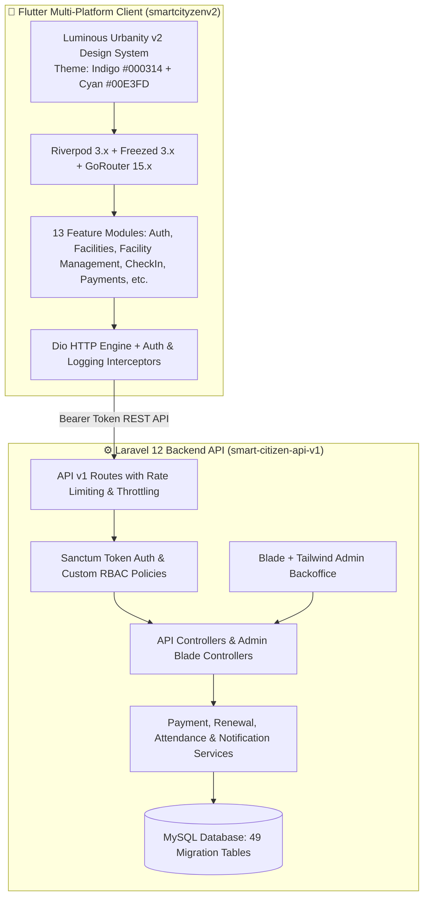

# 📘 Smart Cityzen Platform — Complete Master Handover Document (19 Aug 2026)

**Ecosystem:** Laravel API Backend (`smart-citizen-api-v1`) & Flutter Cross-Platform Client (`smartcityzenv2`)  
**Date of Compilation:** August 19, 2026  
**Document Version:** 1.1.0 — Detailed Database Schema Edition  

---

## 🧭 1. Executive Summary & Ecosystem Overview

The **Smart Cityzen Platform** is an end-to-end municipal civic infrastructure, public/private facility management (Gyms, Libraries, Recreation Centers), citizen digital identity pass, QR/RFID turnstile access control, and automated billing ecosystem.

### System Architecture Flow



---

## 🏛️ 2. Laravel API Backend Architecture (`smart-citizen-api-v1`)

### 2.1 Tech Stack & Dependencies
* **Framework:** Laravel 12 running on PHP 8.4
* **Authentication:** Laravel Sanctum (Bearer Tokens, Personal Access Tokens)
* **Code Formatter:** Laravel Pint (`vendor/bin/pint --format agent`)
* **Testing:** PHPUnit with database factories
* **Admin UI:** Blade templates styled with Tailwind CSS, Alpine.js, and Chart.js

---

### 2.2 Complete Database Schema Specification

All entity IDs use alphanumeric string-prefixed unique identifiers (`CHAR(10)` generated via custom NanoID/ULID or Base62 helpers) to prevent sequential enumeration attacks.

#### 🪪 ID Prefix Standards:
* `USR...` — Users (`users`)
* `CTY...` — Cities (`cities`)
* `ATT...` — City Attractions (`city_attractions`)
* `LIB...` — Libraries (`libraries`)
* `GYM...` — Gyms (`gyms`)
* `FEE...` — Fee Plans (`fee_plans`)
* `LBM...` — Library Members (`library_members`)
* `GMM...` — Gym Members (`gym_members`)
* `LAT...` — Library Attendance (`library_attendance`)
* `GAT...` — Gym Attendance (`gym_attendance`)
* `PAY...` — Payments (`payments`)
* `REN...` — Membership Renewals (`membership_renewals`)
* `EXP...` — Facility Exceptions (`facility_exceptions`)
* `TCK...` — Support Tickets (`tickets`)
* `ENQ...` — Facility Enquiries (`facility_enquiries`)
* `MED...` — Uploaded Media (`media`)

---

#### 🗄️ Detailed Table-by-Table Schema:

```
================================================================================
1. USERS & SECURITY
================================================================================

TABLE: users
  id                     CHAR(10) PRIMARY KEY       -- e.g. USR9K2M1X9
  name                   VARCHAR(255) NOT NULL
  email                  VARCHAR(255) UNIQUE NOT NULL
  phone                  VARCHAR(30) NULL
  city_id                CHAR(10) NOT NULL           -- FK -> cities(id)
  role                   VARCHAR(20) DEFAULT 'customer' -- admin, manager, staff, member, customer, user
  status                 VARCHAR(20) DEFAULT 'active'   -- active, inactive, blocked
  custom_permissions     JSON NULL
  email_verified_at      TIMESTAMP NULL
  password               VARCHAR(255) NOT NULL
  oauth_provider         VARCHAR(30) NULL            -- google, facebook
  oauth_id               VARCHAR(191) NULL
  is_onboarded           BOOLEAN DEFAULT 0
  is_client              BOOLEAN DEFAULT 0
  avatar                 VARCHAR(255) NULL
  address                VARCHAR(255) NULL
  emergency_contact      VARCHAR(50) NULL
  bio                    TEXT NULL
  created_by             CHAR(10) NULL               -- FK -> users(id)
  updated_by             CHAR(10) NULL               -- FK -> users(id)
  deleted_by             CHAR(10) NULL               -- FK -> users(id)
  created_at / updated_at / deleted_at (SoftDeletes)
  INDEXES: (email), (role, status), (city_id)

TABLE: personal_access_tokens
  id                     BIGINT UNSIGNED AUTO_INCREMENT PRIMARY KEY
  tokenable_type         VARCHAR(255) NOT NULL
  tokenable_id           CHAR(10) NOT NULL
  name                   VARCHAR(255) NOT NULL
  token                  VARCHAR(64) UNIQUE NOT NULL
  abilities              TEXT NULL
  last_used_at           TIMESTAMP NULL
  expires_at             TIMESTAMP NULL
  created_at / updated_at

TABLE: login_histories
  id                     BIGINT UNSIGNED AUTO_INCREMENT PRIMARY KEY
  user_id                CHAR(10) NOT NULL           -- FK -> users(id) ON DELETE CASCADE
  email                  VARCHAR(255) NOT NULL
  ip_address             VARCHAR(45) NOT NULL
  user_agent             TEXT NULL
  device_type            VARCHAR(50) NULL            -- Mobile, Tablet, Desktop
  browser                VARCHAR(50) NULL
  platform               VARCHAR(50) NULL            -- iOS, Android, macOS, Windows
  location               VARCHAR(150) NULL
  status                 VARCHAR(20) NOT NULL        -- success, failed, blocked
  failure_reason         VARCHAR(255) NULL
  is_suspicious          BOOLEAN DEFAULT 0
  flagged_reason         VARCHAR(255) NULL
  created_at             TIMESTAMP
  INDEXES: (user_id, status), (ip_address), (is_suspicious)

TABLE: audit_logs
  id                     BIGINT UNSIGNED AUTO_INCREMENT PRIMARY KEY
  user_id                CHAR(10) NULL               -- FK -> users(id) ON DELETE SET NULL
  action                 VARCHAR(50) NOT NULL        -- create, update, delete, status_change, refund
  model_type             VARCHAR(100) NOT NULL
  model_id               CHAR(10) NOT NULL
  old_values             JSON NULL
  new_values             JSON NULL
  ip_address             VARCHAR(45) NULL
  user_agent             TEXT NULL
  created_at             TIMESTAMP
  INDEXES: (model_type, model_id), (user_id, created_at)

================================================================================
2. CITIES & TOURISM
================================================================================

TABLE: cities
  id                     CHAR(10) PRIMARY KEY       -- e.g. CTYDELHI01
  name                   VARCHAR(100) NOT NULL
  state                  VARCHAR(100) NOT NULL
  tagline                VARCHAR(255) NULL
  description            TEXT NULL
  latitude               DECIMAL(10,8) NULL
  longitude              DECIMAL(11,8) NULL
  is_capital             BOOLEAN DEFAULT 0
  timezone               VARCHAR(50) DEFAULT 'Asia/Kolkata'
  created_at / updated_at
  INDEXES: (name), (state), (is_capital)

TABLE: city_attractions
  id                     CHAR(10) PRIMARY KEY       -- e.g. ATTMZN0001
  city_id                CHAR(10) NOT NULL          -- FK -> cities(id) ON DELETE CASCADE
  name                   VARCHAR(150) NOT NULL
  description            TEXT NULL
  category               VARCHAR(50) NOT NULL       -- Monument, Park, Museum, Heritage
  address                VARCHAR(255) NOT NULL
  latitude               DECIMAL(10,8) NULL
  longitude              DECIMAL(11,8) NULL
  entry_fee              DECIMAL(10,2) DEFAULT 0.00
  opening_time           TIME NULL
  closing_time           TIME NULL
  created_at / updated_at
  INDEXES: (city_id, category)

TABLE: city_information
  id                     CHAR(10) PRIMARY KEY
  city_id                CHAR(10) NOT NULL          -- FK -> cities(id) ON DELETE CASCADE
  title                  VARCHAR(150) NOT NULL
  history                LONGTEXT NULL
  culture                LONGTEXT NULL
  heritage_facts         JSON NULL
  emergency_contacts     JSON NULL                  -- Police, Ambulance, Fire numbers
  created_at / updated_at

================================================================================
3. CIVIC FACILITIES (GYMS & LIBRARIES)
================================================================================

TABLE: libraries
  id                     CHAR(10) PRIMARY KEY       -- e.g. LIB8K2M1X9
  name                   VARCHAR(255) NOT NULL
  description            TEXT NULL
  address                VARCHAR(255) NOT NULL
  city_id                CHAR(10) NOT NULL          -- FK -> cities(id)
  owner_id               CHAR(10) NULL              -- FK -> users(id)
  latitude               DECIMAL(10,8) NULL
  longitude              DECIMAL(11,8) NULL
  contact_phone          VARCHAR(30) NULL
  contact_email          VARCHAR(255) NULL
  opening_time           TIME NOT NULL
  closing_time           TIME NOT NULL
  status                 VARCHAR(20) DEFAULT 'active' -- active, inactive, maintenance
  created_by             CHAR(10) NULL              -- FK -> users(id)
  created_at / updated_at / deleted_at (SoftDeletes)
  INDEXES: (city_id, status), (status, deleted_at)

TABLE: gyms
  id                     CHAR(10) PRIMARY KEY       -- e.g. GYM8K2M1X9
  name                   VARCHAR(255) NOT NULL
  description            TEXT NULL
  address                VARCHAR(255) NOT NULL
  city_id                CHAR(10) NOT NULL          -- FK -> cities(id)
  owner_id               CHAR(10) NULL              -- FK -> users(id)
  latitude               DECIMAL(10,8) NULL
  longitude              DECIMAL(11,8) NULL
  contact_phone          VARCHAR(30) NULL
  contact_email          VARCHAR(255) NULL
  opening_time           TIME NOT NULL
  closing_time           TIME NOT NULL
  status                 VARCHAR(20) DEFAULT 'active'
  created_by             CHAR(10) NULL              -- FK -> users(id)
  created_at / updated_at / deleted_at (SoftDeletes)
  INDEXES: (city_id, status), (status, deleted_at)

TABLE: amenities
  id                     BIGINT UNSIGNED AUTO_INCREMENT PRIMARY KEY
  name                   VARCHAR(100) NOT NULL
  icon                   VARCHAR(50) NOT NULL       -- FontAwesome / Material Icon identifier
  category               VARCHAR(50) NOT NULL       -- General, Fitness, Study, Utilities
  created_at / updated_at

TABLE: amenity_facility
  id                     BIGINT UNSIGNED AUTO_INCREMENT PRIMARY KEY
  amenity_id             BIGINT UNSIGNED NOT NULL   -- FK -> amenities(id) ON DELETE CASCADE
  facility_type          VARCHAR(100) NOT NULL      -- Gym, Library
  facility_id            CHAR(10) NOT NULL
  INDEXES: (facility_type, facility_id, amenity_id)

TABLE: fee_plans
  id                     CHAR(10) PRIMARY KEY       -- e.g. FEE8K2M1X9
  facility_type          VARCHAR(100) NOT NULL      -- Gym, Library
  facility_id            CHAR(10) NOT NULL
  name                   VARCHAR(100) NOT NULL      -- e.g. "Gold Monthly", "Student Pass"
  interval               VARCHAR(20) NOT NULL       -- hour, day, week, month, year
  interval_count         INT DEFAULT 1
  amount                 DECIMAL(10,2) NOT NULL
  currency               VARCHAR(3) DEFAULT 'INR'
  is_active              BOOLEAN DEFAULT 1
  description            TEXT NULL
  created_at / updated_at
  INDEXES: (facility_type, facility_id, is_active)

TABLE: facility_exceptions
  id                     CHAR(10) PRIMARY KEY       -- e.g. EXP8K2M1X9
  facility_type          VARCHAR(100) NOT NULL      -- Gym, Library
  facility_id            CHAR(10) NOT NULL
  user_id                CHAR(10) NULL              -- FK -> users(id) ON DELETE SET NULL
  exception_type         VARCHAR(30) NOT NULL       -- fee_waiver, grace_period, membership_freeze, attendance_override, custom_discount
  reason                 VARCHAR(255) NOT NULL
  details                JSON NULL
  approved_by            CHAR(10) NULL              -- FK -> users(id)
  starts_at              TIMESTAMP NOT NULL
  expires_at             TIMESTAMP NOT NULL
  status                 VARCHAR(20) DEFAULT 'active' -- active, revoked, expired
  created_at / updated_at
  INDEXES: (facility_type, facility_id, status), (user_id, status)

TABLE: facility_staff
  id                     BIGINT UNSIGNED AUTO_INCREMENT PRIMARY KEY
  facility_type          VARCHAR(100) NOT NULL      -- Gym, Library
  facility_id            CHAR(10) NOT NULL
  user_id                CHAR(10) NOT NULL          -- FK -> users(id) ON DELETE CASCADE
  role                   VARCHAR(30) NOT NULL       -- manager, trainer, librarian, desk_staff
  permissions            JSON NULL
  created_at / updated_at
  INDEXES: (facility_type, facility_id, user_id)

================================================================================
4. MEMBERSHIPS & TURNSTILE ATTENDANCE
================================================================================

TABLE: gym_members
  id                     CHAR(10) PRIMARY KEY       -- e.g. GMM8K2M1X9
  gym_id                 CHAR(10) NOT NULL          -- FK -> gyms(id) ON DELETE CASCADE
  user_id                CHAR(10) NOT NULL          -- FK -> users(id) ON DELETE CASCADE
  membership_type        VARCHAR(30) NOT NULL       -- daily, monthly, quarterly, annual
  start_date             DATE NOT NULL
  end_date               DATE NOT NULL
  status                 VARCHAR(20) DEFAULT 'active' -- active, inactive, expired, suspended
  created_by             CHAR(10) NULL              -- FK -> users(id)
  created_at / updated_at / deleted_at (SoftDeletes)
  INDEXES: (gym_id, user_id), (status, end_date)

TABLE: library_members
  id                     CHAR(10) PRIMARY KEY       -- e.g. LBM8K2M1X9
  library_id             CHAR(10) NOT NULL          -- FK -> libraries(id) ON DELETE CASCADE
  user_id                CHAR(10) NOT NULL          -- FK -> users(id) ON DELETE CASCADE
  membership_type        VARCHAR(30) NOT NULL       -- standard, student, researcher, annual
  start_date             DATE NOT NULL
  end_date               DATE NOT NULL
  status                 VARCHAR(20) DEFAULT 'active'
  created_by             CHAR(10) NULL              -- FK -> users(id)
  created_at / updated_at / deleted_at (SoftDeletes)
  INDEXES: (library_id, user_id), (status, end_date)

TABLE: gym_attendance
  id                     CHAR(10) PRIMARY KEY       -- e.g. GAT8K2M1X9
  gym_id                 CHAR(10) NOT NULL          -- FK -> gyms(id) ON DELETE CASCADE
  member_id              CHAR(10) NOT NULL          -- FK -> gym_members(id) ON DELETE CASCADE
  check_in_at            TIMESTAMP NOT NULL
  check_out_at           TIMESTAMP NULL
  duration               INT NULL                   -- Minutes spent inside
  date                   DATE NOT NULL
  request_id             VARCHAR(64) NULL
  created_at / updated_at
  INDEXES: (gym_id, member_id, date), (check_in_at, check_out_at)

TABLE: library_attendance
  id                     CHAR(10) PRIMARY KEY       -- e.g. LAT8K2M1X9
  library_id             CHAR(10) NOT NULL          -- FK -> libraries(id) ON DELETE CASCADE
  member_id              CHAR(10) NOT NULL          -- FK -> library_members(id) ON DELETE CASCADE
  check_in_at            TIMESTAMP NOT NULL
  check_out_at           TIMESTAMP NULL
  duration               INT NULL
  date                   DATE NOT NULL
  created_at / updated_at
  INDEXES: (library_id, member_id, date)

================================================================================
5. PAYMENTS, RENEWALS & INVOICES
================================================================================

TABLE: payments
  id                     CHAR(10) PRIMARY KEY       -- e.g. PAY8K2M1X9
  user_id                CHAR(10) NOT NULL          -- FK -> users(id) ON DELETE CASCADE
  payable_type           VARCHAR(100) NOT NULL      -- Gym, Library, GymMember, LibraryMember, User
  payable_id             CHAR(10) NOT NULL
  amount                 DECIMAL(12,2) NOT NULL
  currency               VARCHAR(3) DEFAULT 'INR'
  status                 VARCHAR(20) DEFAULT 'pending' -- paid, pending, failed, refunded
  payment_method         VARCHAR(30) DEFAULT 'card'    -- card, upi, bank_transfer, cash, wallet
  transaction_reference  VARCHAR(100) NULL          -- Gateway Transaction ID (Razorpay/Stripe)
  invoice_number         VARCHAR(50) UNIQUE NOT NULL-- e.g. INV-2026-08-0001
  due_date               DATE NULL
  paid_at                TIMESTAMP NULL
  refunded_amount        DECIMAL(12,2) NULL         -- Added via 2026_08_18 refund migration
  refund_reason          TEXT NULL
  refunded_at            TIMESTAMP NULL
  refunded_by            CHAR(10) NULL              -- FK -> users(id) ON DELETE SET NULL
  notes                  TEXT NULL
  created_by             CHAR(10) NULL              -- FK -> users(id)
  created_at / updated_at / deleted_at (SoftDeletes)
  INDEXES: (user_id, status), (payable_type, payable_id), (status, due_date), (created_at)

TABLE: membership_renewals
  id                     CHAR(10) PRIMARY KEY       -- e.g. REN8K2M1X9
  user_id                CHAR(10) NOT NULL          -- FK -> users(id) ON DELETE CASCADE
  membership_type        VARCHAR(30) NOT NULL       -- GymMember, LibraryMember
  membership_id          CHAR(10) NOT NULL
  fee_plan_id            CHAR(10) NOT NULL          -- FK -> fee_plans(id)
  payment_id             CHAR(10) NOT NULL          -- FK -> payments(id)
  previous_end_date      DATE NOT NULL
  new_end_date           DATE NOT NULL
  extended_interval      VARCHAR(20) NOT NULL       -- day, week, month, year
  extended_count         INT NOT NULL
  amount_paid            DECIMAL(10,2) NOT NULL
  currency               VARCHAR(3) DEFAULT 'INR'
  notes                  TEXT NULL
  created_at             TIMESTAMP
  INDEXES: (membership_type, membership_id), (user_id)

================================================================================
6. COMMUNICATIONS, SUPPORT & MEDIA
================================================================================

TABLE: facility_enquiries
  id                     BIGINT UNSIGNED AUTO_INCREMENT PRIMARY KEY
  facility_type          VARCHAR(50) NOT NULL       -- gym, library
  facility_id            CHAR(10) NOT NULL
  user_id                CHAR(10) NULL              -- FK -> users(id) (NULL if public guest)
  name                   VARCHAR(100) NOT NULL
  email                  VARCHAR(150) NOT NULL
  phone                  VARCHAR(30) NULL
  subject                VARCHAR(200) NOT NULL
  status                 VARCHAR(20) DEFAULT 'open' -- open, in_progress, resolved, closed
  created_at / updated_at

TABLE: facility_enquiry_messages
  id                     BIGINT UNSIGNED AUTO_INCREMENT PRIMARY KEY
  enquiry_id             BIGINT UNSIGNED NOT NULL   -- FK -> facility_enquiries(id) ON DELETE CASCADE
  sender_type            VARCHAR(20) NOT NULL       -- citizen, staff
  sender_id              CHAR(10) NULL              -- FK -> users(id)
  message                TEXT NOT NULL
  created_at             TIMESTAMP

TABLE: facility_communications
  id                     BIGINT UNSIGNED AUTO_INCREMENT PRIMARY KEY
  facility_type          VARCHAR(50) NOT NULL
  facility_id            CHAR(10) NOT NULL
  sender_id              CHAR(10) NOT NULL          -- FK -> users(id)
  type                   VARCHAR(30) NOT NULL       -- broadcast, announcement, emergency
  channels               JSON NOT NULL              -- ["email", "sms", "in_app"]
  title                  VARCHAR(200) NOT NULL
  content                TEXT NOT NULL
  recipient_count        INT DEFAULT 0
  created_at             TIMESTAMP

TABLE: tickets
  id                     CHAR(10) PRIMARY KEY       -- e.g. TCK8K2M1X9
  user_id                CHAR(10) NOT NULL          -- FK -> users(id) ON DELETE CASCADE
  subject                VARCHAR(255) NOT NULL
  category               VARCHAR(50) NOT NULL       -- billing, access, general, maintenance
  priority               VARCHAR(20) DEFAULT 'medium' -- low, medium, high, urgent
  status                 VARCHAR(20) DEFAULT 'open'   -- open, in_progress, resolved, closed
  assigned_to            CHAR(10) NULL              -- FK -> users(id)
  created_at / updated_at

TABLE: ticket_messages
  id                     BIGINT UNSIGNED AUTO_INCREMENT PRIMARY KEY
  ticket_id              CHAR(10) NOT NULL          -- FK -> tickets(id) ON DELETE CASCADE
  user_id                CHAR(10) NOT NULL          -- FK -> users(id)
  message                TEXT NOT NULL
  created_at             TIMESTAMP

TABLE: media
  id                     CHAR(10) PRIMARY KEY       -- e.g. MED8K2M1X9
  mediable_type          VARCHAR(100) NOT NULL      -- Gym, Library, CityAttraction, User
  mediable_id            CHAR(10) NOT NULL
  file_path              VARCHAR(255) NOT NULL
  file_name              VARCHAR(255) NOT NULL
  mime_type              VARCHAR(100) NOT NULL
  file_size              BIGINT UNSIGNED NOT NULL
  collection_name        VARCHAR(50) DEFAULT 'default' -- avatar, gallery, document, receipt
  custom_properties      JSON NULL
  created_at / updated_at
  INDEXES: (mediable_type, mediable_id, collection_name)

TABLE: email_templates & email_logs
  email_templates: (id, name, subject, body_html, body_text, variables, is_active)
  email_logs: (id, recipient, template_id, subject, body, headers, status, sent_at)

TABLE: system_settings & saved_sql_queries
  system_settings: (id, key, value, group, description, is_public)
  saved_sql_queries: (id, name, query, description, created_by, run_count, last_run_at)
```

---

### 2.3 Comprehensive API Endpoint Catalog

#### **Public & Guest Routes (`/api/v1`):**
* `GET /health` & `GET /api/v1/health` — System status & service connectivity checks.
* `POST /incidents` — Client-side exception & crash ingestion.
* `GET /cities` & `GET /cities/{id}` — Cities list and metadata.
* `GET /cities/{city_id}/attractions` & `GET /cities/{city_id}/information` — Heritage & tourist spots.
* `POST /onboard/user`, `/onboard/library`, `/onboard/gym`, `/onboard/complete` — Self-service facility owner onboarding.
* `POST /auth/register`, `/auth/login`, `/auth/forgot-password`, `/auth/reset-password` — Core auth.
* `GET /auth/oauth/{provider}/redirect` & `POST /auth/oauth/{provider}` — Google & Facebook social logins.
* `POST /facilities/{type}/{id}/enquiries` — Public citizen facility enquiry submission.

#### **Protected Routes (`auth:sanctum` + `user.status`):**
* **Auth & Profile:** `POST /auth/logout`, `POST /auth/logout-all`, `GET /auth/me`, `GET /auth/login-history`, `POST /auth/change-password`, `PATCH /users/{id}`, `POST /users/{id}/photo`.
* **Facilities Explorer:** `GET /libraries`, `GET /libraries/{id}`, `GET /libraries/{id}/fee-plans`, `GET /gyms`, `GET /gyms/{id}`, `GET /gyms/{id}/fee-plans`.
* **Turnstile Attendance:**
  * `POST /gyms/{id}/attendance/check-in` (`member_id`) — 201 Created (400 if expired, 409 if active session open).
  * `POST /gyms/{id}/attendance/check-out` (`attendance_id`) — 200 OK.
  * `GET /gyms/{id}/attendance/members/{member_id}/attendance` — Member's own paginated check-in history.
  * `GET /libraries/{id}/attendance/members/{member_id}/attendance` — Library check-in history.
* **Payments & Billing:**
  * `GET /payments` — Self-scoped payment history (filtering `where('user_id', actor.id)` for citizen role).
  * `GET /payments/{id}` — Individual invoice & payment receipt details.
* **Facility Exceptions & Discounts:** `GET /exceptions` — Active discounts/waivers for user.
* **Support & Tickets:** `GET /tickets`, `POST /tickets`, `GET /tickets/{id}`, `POST /tickets/{id}/messages`.

---

## 📱 3. Flutter Client Architecture (`smartcityzenv2`)

### 3.1 Toolchain Rules & Configuration

1. **`flutter_form_builder`:** MUST be `^10.3.0`+ (prevents `flutter_localizations` SDK conflict).
2. **State Management & Codegen:** 
   * Riverpod 3.x (`flutter_riverpod ^3.0.0`, `riverpod_annotation ^3.0.0`, `riverpod_generator ^3.0.0`).
   * Freezed 3.x (`freezed ^3.0.0`, `freezed_annotation ^3.0.0`).
3. **CRITICAL Freezed 3.x Syntax:** Every `@freezed` class MUST be declared as `abstract class ModelName with _$ModelName`.
4. **Code Generation:** Run `dart run build_runner build --delete-conflicting-outputs`.
5. **Localization:** 5 complete ARB files in `lib/l10n/app_{en,hi,es,fr,ar}.arb` compiled to `lib/l10n/gen/`.

---

### 3.2 Design System: "Luminous Urbanity v2"

* **Color Palette:**
  * Background: `#000314` (Deep Urban Void)
  * Surface Glass: `rgba(13, 17, 38, 0.65)` with `BackdropFilter` Gaussian blur (20px)
  * Primary Neon: `#00E3FD` (Cyber Cyan Accent)
  * Secondary Gradient: `#7B2CBF` (Electric Violet) $\to$ `#3A0CA3`
  * Text Primary: `#F8FAFC`, Secondary: `#94A3B8`
* **Responsive Breakpoints:**
  * Mobile (`< 900px`): Adaptive Glass Bottom Navigation Bar.
  * Desktop/Tablet/Web (`≥ 900px`): Persistent Left Glassmorphic Navigation Rail.

---

### 3.3 Feature Modules Breakdown (`lib/features/`)

```
lib/
├── core/
│   ├── config/ (app_config.dart with shared_preferences runtime URL switcher)
│   ├── network/ (dio_client.dart with auth & error interceptors)
│   ├── router/ (app_router.dart GoRouter with auth guard)
│   └── theme/ (app_colors.dart, app_theme.dart)
├── data/
│   └── models/ (All 12 Freezed 3.x models: User, City, Facility, Payment, Attendance, etc.)
├── features/
│   ├── auth/ (Login, Register, Forgot Password, Reset Password, OAuth)
│   ├── checkin/ (Camera QR Scanner for staff & gate turnstiles)
│   ├── city/ (City directory, Attractions list, Heritage view)
│   ├── facilities/ (Gyms & Libraries listing, filters, details screen)
│   ├── facility_management/ (Facility Owner/Staff Console: Edit details, fee plans, staff, holidays)
│   ├── home/ (Dashboard, Cityzen ID Hero Card, Active Memberships Summary)
│   ├── membership/ (QR Identity Pass, Active Passes, Validity counters, Renewals)
│   ├── onboard/ (Facility & owner self-service onboarding wizard)
│   ├── payments/ (Payment history ledger, in-app receipt preview, refund notices)
│   ├── profile/ (Profile view, Edit profile, Avatar uploader)
│   ├── security/ (Login history, Active devices, Change password, Logout all)
│   ├── settings/ (Runtime API URL switcher, Latency tester, Log level toggle)
│   └── support/ (Facility enquiries & Civic grievance tickets)
└── shared/
    └── widgets/ (GlassContainer, NeonButton, StatusBadge, CustomAppBar)
```

---

## 🔒 4. Key Architectural Constraints & Gotchas

1. **No Self-Service Membership Join/Renew via Public API:**
   * `POST /libraries/{id}/members`, `POST /gyms/{id}/members`, and `.../renew` require staff/manager/admin permissions.
   * *Customer Workflow:* Customers browse fee plans in the app and contact facility staff via phone/email/enquiry CTA to complete enrollment.
2. **Deriving "My Memberships" on Flutter:**
   * `GET /libraries/{id}/members` is permission-gated against customers.
   * The Flutter app derives a customer's active memberships by calling `GET /payments` (self-scoped) and extracting `payable_type` (`GymMember` / `LibraryMember`) and `payable_id`.
3. **Attendance History Scoping:**
   * Global `GET .../attendance` returns facility-wide logs.
   * Citizen view MUST call `.../attendance/members/{member_id}/attendance` which is strictly self-scoped.
4. **Refund Workflow:**
   * Payments can be partially or fully refunded via the Laravel Admin Console ([AdminPaymentController.php](file:///Users/abhishekgupta/Documents/LARAVELS/smart-citizen-api-v1/app/Http/Controllers/Admin/AdminPaymentController.php)).
   * Refunds record `refunded_amount`, `refund_reason`, `refunded_at`, `refunded_by`, and trigger [`PaymentRefundedMail`](file:///Users/abhishekgupta/Documents/LARAVELS/smart-citizen-api-v1/app/Mail/PaymentRefundedMail.php).
   * Flutter Payment Model displays the refund status and adjusted receipts.

---

## 🚀 5. Roadmap Status (Strategic Alignment)

| Phase | Focus Area | Status |
| :--- | :--- | :--- |
| **Phase 1** | Production Hardening, Gateway Webhooks & Sentry Observability | 🟡 In Progress |
| **Phase 2** | Real-Time Reverb / WebSockets & FCM Push Notifications | ⏳ Next Up |
| **Phase 3** | Automated Subscriptions, UPI Auto-Debit & GST Compliance | ⏳ Planned |
| **Phase 4** | Turnstile / Flap Barrier IoT Gateways & Offline SQLite Sync | ⏳ Planned |
| **Phase 5** | AI Predictive Attendance & Churn Prevention Insights | ⏳ Planned |
| **Phase 6** | Multi-Tenancy & Municipal White-Label Franchising | ⏳ Planned |

---
*Generated and verified across both workspaces on August 19, 2026.*
