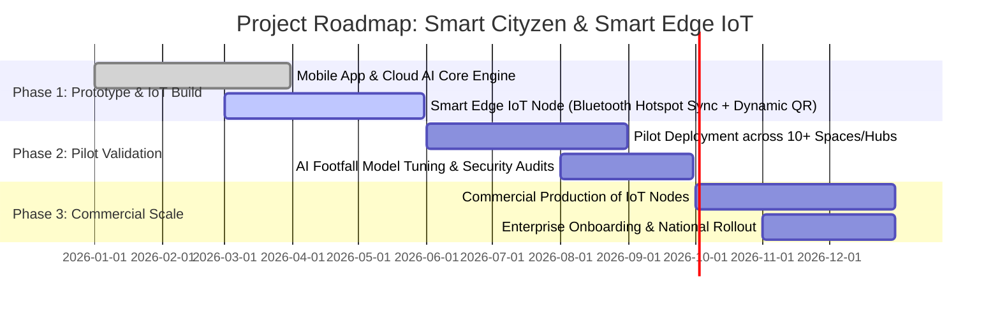

# 🚀 Project Innovation Proposal: Smart Cityzen
### *Next-Gen Autonomous Access, Ambient IoT & AI Space Orchestration Platform*
**Document Date:** August 26, 2026  
**Document Type:** Seed Funding / Innovation Grant Proposal

---

## 1. Executive Summary & Vision

**Smart Cityzen** is an intelligent, hardware-software integrated ecosystem that reimagines how people discover, access, and experience physical spaces. By combining a modern consumer mobile app with a **proprietary, pocket-sized Ambient IoT Edge Device** and an **AI-powered space intelligence engine**, the platform eliminates physical barriers, outdated access hardware, and proxy fraud.

Instead of heavy, expensive metal entry gates or easily spoofed static paper/printed QR codes, Smart Cityzen introduces **Autonomous Zero-Touch Access**: an ultra-portable IoT display node configured in seconds via smartphone Bluetooth, streaming dynamic cryptographic verification codes synchronized with real-time cloud and predictive AI analytics.

---

## 2. The Core Problem: The Broken Physical-to-Digital Gap

Modern physical venues—such as premium co-working spaces, fitness centers, sports arenas, wellness clubs, and private member spaces—face critical bottlenecks:

```
┌───────────────────────────┐    ┌───────────────────────────┐    ┌───────────────────────────┐
│     Expensive Legacy      │    │    Static QR & Ticket     │    │   Zero Real-Time Spatial  │
│        Hardware           │    │          Fraud            │    │        Intelligence       │
├───────────────────────────┤    ├───────────────────────────┤    ├───────────────────────────┤
│ Heavy gates, RFID cards,  │    │ Screenshots, pass-sharing │    │ Space operators have no   │
│ and biometric readers     │    │ and spoofed tickets cause │    │ predictive visibility     │
│ cost thousands of dollars │    │ massive revenue leakage   │    │ into live capacity, churn │
│ with high maintenance.    │    │ and security blindspots.  │    │ or member behavior.       │
└───────────────────────────┘    └───────────────────────────┘    └──────────────────────────┘
```

---

## 3. The Breakthrough Solution: The 3-Pillar Ecosystem

```
             ┌─────────────────────────────────────────────────────────┐
             │               1. Smart Consumer App                     │
             │   Biometric Identity • Smart Booking • Digital Passes   │
             └────────────────────────────┬────────────────────────────┘
                                          │
                     Bluetooth Provisioning & Cloud Sync
                                          │
             ┌────────────────────────────▼────────────────────────────┐
             │        2. Proprietary Smart Edge IoT Node               │
             │   Instant Bluetooth-to-WiFi Config • Dynamic Rolling QR Engine│
             └────────────────────────────┬────────────────────────────┘
                                          │
                             Real-Time Stream & Telemetry
                                          │
             ┌────────────────────────────▼────────────────────────────┐
             │       3. AI Space Intelligence & Analytics Hub          │
             │  Occupancy Forecasting • Dynamic Slots • Churn Engine   │
             └─────────────────────────────────────────────────────────┘
```

### Pillar 1: The Unified Consumer App
- **Biometric Smart Pass:** Single-tap biometric verification (FaceID/Fingerprint) turning every smartphone into a tamper-proof digital membership passport.
- **Dynamic Slot & Facility Discovery:** Frictionless scheduling, recurring subscriptions, and seamless digital payments.
- **Hyper-Personalized Venue Experience:** Personalized recommendations based on user activity, preferences, and peak/off-peak routines.

### Pillar 2: Proprietary Smart Edge IoT Device *(The Hardware Innovation)*
A pocket-sized, low-power smart display node designed for instant deployment without complex wiring or IT infrastructure:
- **Zero-Touch Bluetooth-to-WiFi Setup:** The venue manager or host simply opens their mobile app, detects the device over Bluetooth, and securely transmits WiFi or mobile hotspot credentials in 3 seconds.
- **Dynamic Cryptographic QR Generation:** Once connected, the device autonomously connects to the cloud engine and renders a **live, rolling, time-sensitive cryptographic QR code** that refreshes automatically every few seconds.
- **Screenshot & Fraud Protection:** A screenshot becomes useless before it can be reused, preventing pass forwarding, unauthorized entries, and proxy check-ins.
- **Edge Resilience:** Built-in edge memory allows uninterrupted access validation even during momentary internet drops.

### Pillar 3: AI Space Intelligence Engine
- **Predictive Footfall & Capacity Forecasting:** Deep learning models analyze historical traffic to forecast peak hours and dynamically optimize slot availability.
- **Dynamic Pricing & Load Balancing:** Automatically incentivizes off-peak bookings through dynamic pricing models to maximize venue revenue.
- **Behavioral Insights & Churn Prevention:** Identifies declining member engagement patterns early and triggers targeted retention actions.

---

## 4. Key Technological Innovations & Differentiators

| Feature | Legacy Solutions | Generic Apps | **Smart Cityzen Ecosystem** |
| :--- | :--- | :--- | :--- |
| **Setup & Deployment** | Multi-week hardware installation & wiring | None (App-only software) | **Instant 3-second Bluetooth Hotspot/WiFi setup** |
| **Security & Fraud Prevention** | Vulnerable RFID cards / high-cost biometrics | Easily faked static QR screenshots | **Time-synced dynamic rolling cryptographic QR** |
| **Capital Expenditure** | ₹50,000 – ₹2,00,000+ per entry gate | N/A | **Ultra-low cost, pocket-sized plug-and-play node** |
| **Intelligence Layer** | Raw offline timestamp logs | Basic attendance counter | **Predictive AI spatial capacity & revenue engine** |
| **Mobility & Flexibility** | Fixed, rigid installations | Smartphone-only | **Portable anywhere (events, pop-ups, remote facilities)** |

---

## 5. Market Potential & Commercial Use Cases

1. **Fitness & Wellness Clubs:** Automated check-in, dynamic class scheduling, and member utilization tracking without reception congestion.
2. **Co-Working & Shared Workspaces:** Flexible desk and meeting room validation with live occupancy monitoring.
3. **Sports Arenas & Recreation Hubs:** Instant access control for courts, swimming pools, and training grounds with zero hardware friction.
4. **Pop-up Events, Expos & Festivals:** Organizers can carry the pocket IoT node, pair it with their smartphone's mobile hotspot on-site, and have an enterprise-grade digital gate running instantly.
5. **Private Communities & Clubs:** Secure guest pass management and exclusive facility access for authenticated members.

---

## 6. Business & Monetization Model

```
┌───────────────────────────────────────────────────────────────┐
│                     Revenue Streams                           │
├──────────────────────────┬────────────────────────────────────┤
│ 1. Smart Device Sales &  │ Buy the pocket device once or      │
│    Monthly Rental        │ rent it for a small monthly fee    │
├──────────────────────────┼────────────────────────────────────┤
│ 2. Monthly Software      │ Affordable monthly or yearly plan  │
│    Plans for Venues      │ to manage members and entries      │
├──────────────────────────┼────────────────────────────────────┤
│ 3. Small Booking Fee     │ Small convenience fee on paid      │
│                          │ court bookings and instant passes  │
├──────────────────────────┼────────────────────────────────────┤
│ 4. Smart Analytics & AI  │ Optional smart peak hour and       │
│                          │ crowd rush recommendations         │
└──────────────────────────┴────────────────────────────────────┘
```

---

## 7. Execution Roadmap (12-Month Plan)



---

## 8. Seed Fund Utilization & Milestone Plan

| Allocation Category | Budget Share | Key Deliverables & Milestones |
| :--- | :---: | :--- |
| **IoT Hardware R&D & Prototyping** | 35% | PCB design, embedded firmware development (Bluetooth-to-WiFi setup), dynamic display integration, and device enclosure molding. |
| **AI Model & Platform Engineering** | 30% | Predictive occupancy algorithms, cloud synchronization engine, cryptographic verification protocols. |
| **Pilot Testing & Space Deployments** | 20% | Live field pilots across 20+ venues, real-world stress testing, and user feedback iterations. |
| **IP Protection & Certifications** | 10% | Patent filing on the dynamic Bluetooth-to-Cloud cryptographic handshake, safety/wireless certifications (WPC/CE). |
| **Operations & Team Growth** | 5% | Embedded engineering talent, supply chain vendor setup. |

---

## 9. Key Performance Indicators (Grant Evaluation Milestones)

- **Hardware Innovation:** Sub-5 second Bluetooth setup with zero technical knowledge required from venue operators.
- **Security & Integrity:** 100% elimination of proxy entries and pass-sharing through rolling cryptographic tokens.
- **Commercial Validation:** 20+ pilot venue integrations, 15,000+ active user verifications within the grant period.
- **Efficiency Gains:** 90% reduction in hardware setup cost compared to traditional access control systems.
